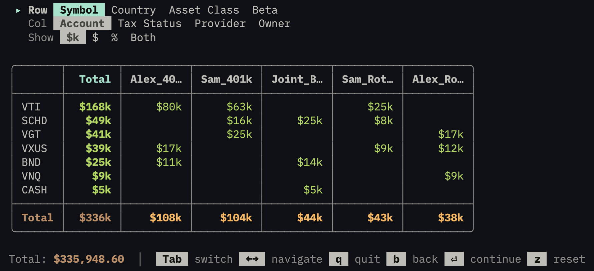

# Rebalance

> **Disclaimer:** This tool is for educational and informational purposes only and is not intended as financial or investment advice. I am not a financial advisor. This software is provided "as-is" with no warranties of accuracy or completeness. It may contain bugs or calculation errors. Do not rely on it for actual investment decisions. Consult a qualified financial professional before making any trades. I accept no liability for any losses or damages arising from use of this tool.

A portfolio rebalancing tool that runs in both the terminal and the browser from a single codebase, powered by [ink-web](https://ink-web.dev). [Read the blog post](https://www.cjroth.com/blog/2026-02-27-building-an-investment-rebalancer-tui).



## What it does

Import your Schwab brokerage holdings (CSV paste or drag-and-drop), set target allocation percentages, and generate the exact trades needed to rebalance — all without sending your data to a server.

The wizard walks you through four steps:

1. **Import** — Paste a CSV, drag-and-drop a file, or pick a demo portfolio
2. **Review** — Browse your holdings across multiple dimensions (symbol, account, country, asset class, tax status, provider, owner)
3. **Targets** — Set target percentages for each symbol with real-time validation
4. **Trades** — Generate trades using one of two strategies, then export as CSV

### Rebalancing strategies

- **Minimize Trades** — Makes the smallest changes needed to hit your targets. Best for taxable accounts or frequent rebalancing.
- **Consolidate** — Moves each symbol into as few accounts as possible. Creates more trades but simplifies your portfolio structure.

Both strategies use a largest-remainder algorithm to convert dollar targets into whole shares while minimizing rounding error and respecting per-account budget constraints.

## How it works

The UI is built with [Ink](https://github.com/vadimdemedes/ink) (React for the terminal). [ink-web](https://ink-web.dev) bridges Ink to the browser by polyfilling Node.js APIs and connecting Ink's renderer to [xterm.js](https://xtermjs.org/). The same React components render natively in both environments — no code duplication.

In the browser, portfolio data is stored locally using the [Origin Private File System](https://developer.mozilla.org/en-US/docs/Web/API/File_System_API/Origin_private_file_system) (OPFS). In the terminal, it uses the local filesystem. A `StorageAdapter` interface abstracts the difference.

## Install

```bash
npm install -g @cjroth/rebalance
```

## Usage

### Browser

```bash
npm run dev
```

Opens at `http://localhost:1420`. Drag and drop a CSV file or paste one in. Everything runs client-side.

### Terminal

```bash
bun src/cli.ts              # full wizard
bun src/cli.ts import       # jump to a specific step
bun src/cli.ts review
bun src/cli.ts targets
bun src/cli.ts trades
bun src/cli.ts ./my-data    # custom data directory (default: ./portfolio-data)
```

### CSV format

The universal CSV format uses `#section` headers:

```csv
#holdings
account,symbol,shares
401k,VTI,100
Roth IRA,VXUS,50

#symbols
name,price,countries,assets,beta
VTI,250.00,us:1.0,equity:1.0,1.0
VXUS,60.00,international:1.0,equity:1.0,1.1

#accounts
name,tax_status,provider,owner
401k,traditional,fidelity,sam
Roth IRA,roth,fidelity,sam

#targets
symbol,percent
VTI,60
VXUS,40
```

Only `#holdings` is required. Charles Schwab CSV exports are also auto-detected and parsed.

## As a library

The rebalancing logic is published as `@cjroth/rebalance` and can be used programmatically:

```ts
import { calculateRebalanceMinTrades, calculateRebalance, convertToWholeShares } from '@cjroth/rebalance'
```

There's also a Next.js-compatible export for embedding the wizard in a web app:

```ts
import { Wizard } from '@cjroth/rebalance/next'
```

## Tech stack

- [React 19](https://react.dev) + [Ink 6](https://github.com/vadimdemedes/ink) — shared UI across terminal and browser
- [ink-web](https://ink-web.dev) — the bridge that makes it work in both environments
- [Vite 7](https://vite.dev) — dev server and bundler
- [Bun](https://bun.sh) — runtime for the CLI
- [Zod 4](https://zod.dev) — schema validation
- [xterm.js](https://xtermjs.org/) — terminal emulator in the browser
- [TypeScript](https://www.typescriptlang.org/) — strict mode throughout
